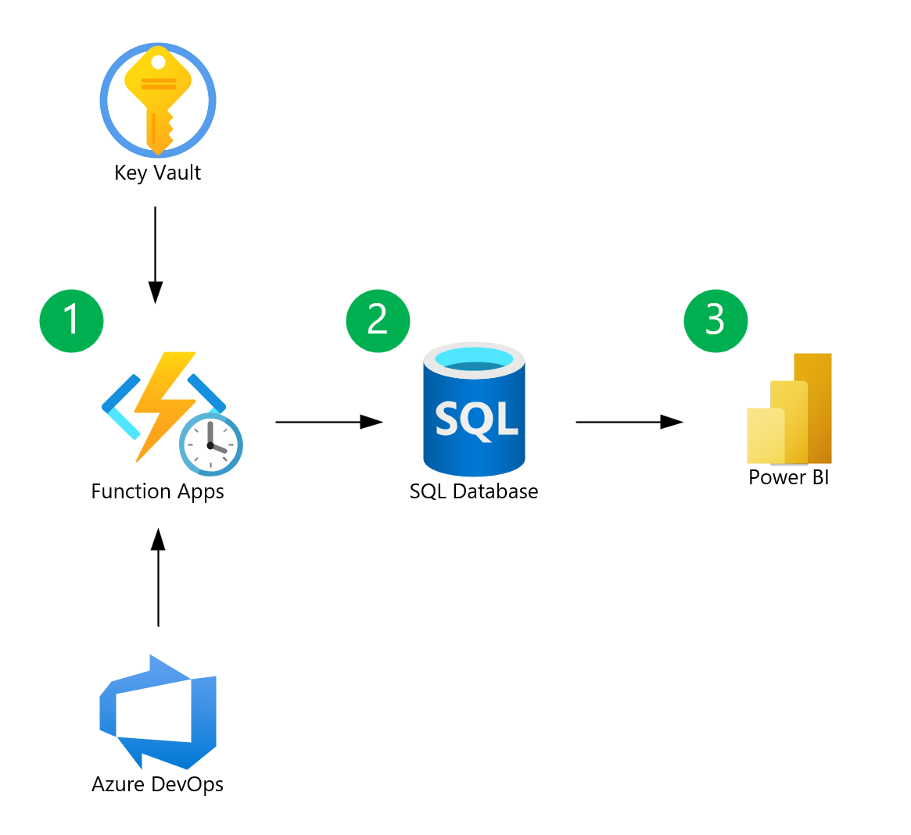

# azure-devops-capacity-analytics

---

| Page Type | Languages | Key Services | Tools    |
| --------- | --------- | ------------ | -------- |
| Sample    | Python    | Azure DevOps | Power BI |

---

# Performing Advanced Capacity Analytics with Azure DevOps

Azure DevOps provides the ability to set and analyze capacity for teams and team members natively [within sprint](https://learn.microsoft.com/en-us/azure/devops/boards/sprints/set-capacity?view=azure-devops) and at a [summarized level across teams](https://learn.microsoft.com/en-us/azure/devops/report/dashboards/widget-catalog?view=azure-devops#sprint-capacity-widget). However, there are times when you may want to perform more advanced analytics on capacity data, such as viewing capacity at a more granular level across teams within a Project, or across multiple Projects within your Organization. Using the Azure DevOps [Capacities API](https://learn.microsoft.com/en-us/rest/api/azure/devops/work/capacities?view=azure-devops-rest-6.0), you can retrieve capacity data and perform advanced analytics on it.

This codebase provides a demonstration of how to retrieve capacity data from the Azure DevOps Capacities API and visualize it in Power BI. A conceptual approach to automating the process for an enterprise setup is also provided.

The scenario presented in this codebase is not intended for production use, and should be viewed as a foundation for modification and expansion into more complex applications.

## Prerequisites

- [An Azure DevOps Organization and Project](https://learn.microsoft.com/en-us/azure/devops/user-guide/sign-up-invite-teammates?view=azure-devops&tabs=microsoft-account)
  - Within your Project, you will need to create a Team and a Sprint, and then begin to assign hours to team members by setting [Capacity per day](https://learn.microsoft.com/en-us/azure/devops/boards/sprints/set-capacity?view=azure-devops#capacity-per-day-entries) and entering entering estimated hours at the task level.
- [Power BI](https://learn.microsoft.com/en-us/power-bi/fundamentals/desktop-get-the-desktop)
  - [Optional - Power BI License](https://learn.microsoft.com/en-us/power-bi/consumer/end-user-license) - for publishing reports to Power BI Service
- [Python](https://www.python.org/downloads/)
- [Optional - Azure Subscription](https://azure.microsoft.com/en-us/free/) - for building enterprise solution

## Running this sample

This sample assumes you are running the code and viewing the report locally.

1. Create a [Personal Access Token](https://learn.microsoft.com/en-us/azure/devops/organizations/accounts/use-personal-access-tokens-to-authenticate?view=azure-devops&tabs=Windows) in Azure DevOps with the `Work Items (read)` and `Work Items (read and write)` scopes.
2. Set an environment variable named `AZDO_PAT` with the value of your Personal Access Token.
3. `cd` into the `app` directory.
4. In the `main` function of `app.py`, modify the `generate_snapshot` function call(s) to pass in your Organization, Project, Team, and Sprint.
5. Run `pip install -r requirements.txt` to install the required Python packages.
6. Run `python app.py` to generate a CSV file containing capacity data for the specified Organization, Project, Team, and Sprint.
7. Import the CSV file into Power BI and visualize the data. You may open the data in the provided Power BI template (`pbi/capacity-template.pbix`) to see an example of how to visualize the data.

#### Modifying `app.py` to modify for your use case

- In the `generate_snapshot` function, there is a block of code that identifies tasks as being work items with a parent from which to pull assigned hours. You can modify this block of code to fit your specific use case/depending on the type of DevOps process you are using.
- The `main` function shows an example of how to call the `generate_snapshot` function for multiple parameter sets. Assuming that the code to pull the data is automated, you may opt to further parameterize the script to to allow for more flexibility how the parameters are passed in (e.g., from a querystring).
- Additional code to connect to a database and store the data is not included in this codebase - outputs are simply written to a CSV. Code to connect to a database can be added as part of an enterprise solution.

#### Authentication to Azure DevOps

- This codebase reads the PAT from an environment variable named `AZDO_PAT`. Depending on your runtime environment, there could be more ideal ways to store the PAT, such as using [Azure Key Vault](https://docs.microsoft.com/en-us/azure/key-vault/general/overview).
- Your PAT will work within an Organization. If you have multiple organizations, you will need to generate a PAT for each one.

## Conceptual Enterprise Architecture & Workflow

The below describes an approach suitable for an enterprise setup that leverages Azure Functions and Azure SQL Database to fully automate the process of retrieving and storing capacity data from the Azure DevOps Capacities API. While this infrastructure is not implemented in this codebase, it serves as a conceptual approach that can be modified to fit your specific needs.

1. An Azure Function is triggered on a schedule (e.g. daily) to retrieve capacity data from the Azure DevOps Capacities API.
2. The Azure Function stores the capacity data in an Azure SQL Database.
3. A Power BI report is connected to the Azure SQL Database and visualizes the refreshed capacity data.

## Potential Business Use Cases

- There are multiple use cases for performing cross-project capacity analytics. For example:
  - In projects that involve multiple organizations (like joint ventures, partnerships, or consortia), cross-organizational capacity planning is crucial for coordinating efforts, timelines, and responsibilities.
  - It supports strategic decision-making by providing insights into the capabilities and limitations of different organizations, allowing for better long-term planning.
  - It helps in identifying bottlenecks and inefficiencies across organizations, leading to improved overall operational efficiency.
- Cross-team capacity analytics could be further complimented by [Azure DevOps Delivery Plans](https://learn.microsoft.com/en-us/azure/devops/boards/plans/add-edit-delivery-plan?view=azure-devops) and [Azure DevOps Analytics Views](https://learn.microsoft.com/en-us/azure/devops/report/powerbi/what-are-analytics-views?view=azure-devops) in project planning.
